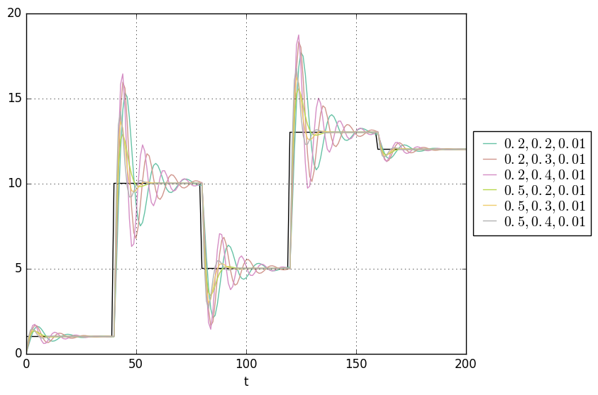

# simpid

**Requires Python 3.5.x**

A simple discrete time PID-controller (basically, something that corrects itself
according to the errors of the past actions, and predicted future error trends)
simulator that allows you to play with combinations of values for the P,I,D coefficients
and plots a graph to allow you to see the values over time. A discrete time PID
is a control variable of the form:

the program plots the values of `y(t+1) = y(t) + u(t)`, with configurable sampling
intervals, maximum time, and target values. If multiple target values are specified,
then they will be distributed evenly along the time axis. For best results specify
an SVG filename as the output.

## usage

    $ pip install -R requirements.txt
    $ ./simpid.py --help

## demo

    $ ./simpid.py --p=0.4,0.5 --i=0.2,0.3,0.4 --d=0.01 --T=200 --k=1,10,5,13,12 abc.svg

